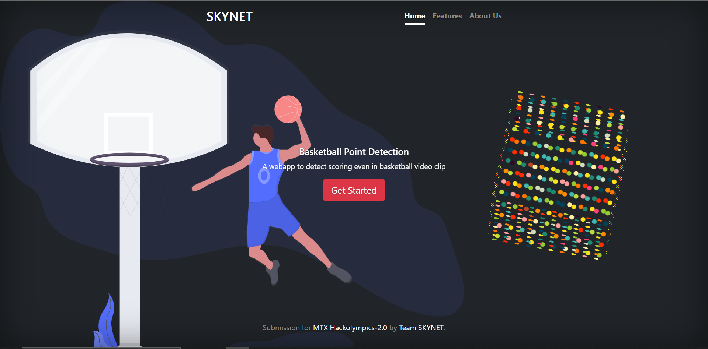
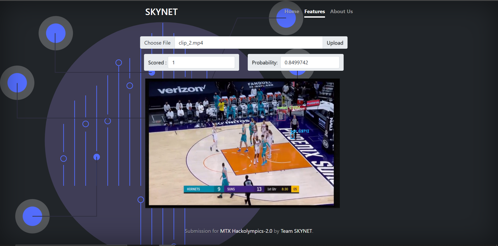

This project aims to use CVI(Computer Vision) and Machine Learning to detect if a basket (2,3 pointer) has been made in the uploaded video or not . 
If the video is longer than 2seconds then , it also analyses the video and outputs a graph of the probability of scoring a basket as time progresses . 
The model uses yolov4 for detecting the ball and the basket in each frame and is combined with XGBoost as the next layer to detect when a basket is made after some preprocessing.

The frontend is made in django using simple html , css and js.

Other features are soon to come ...
